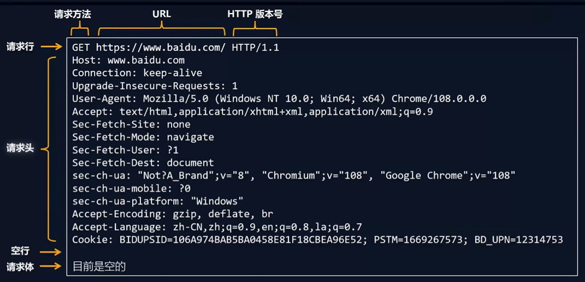
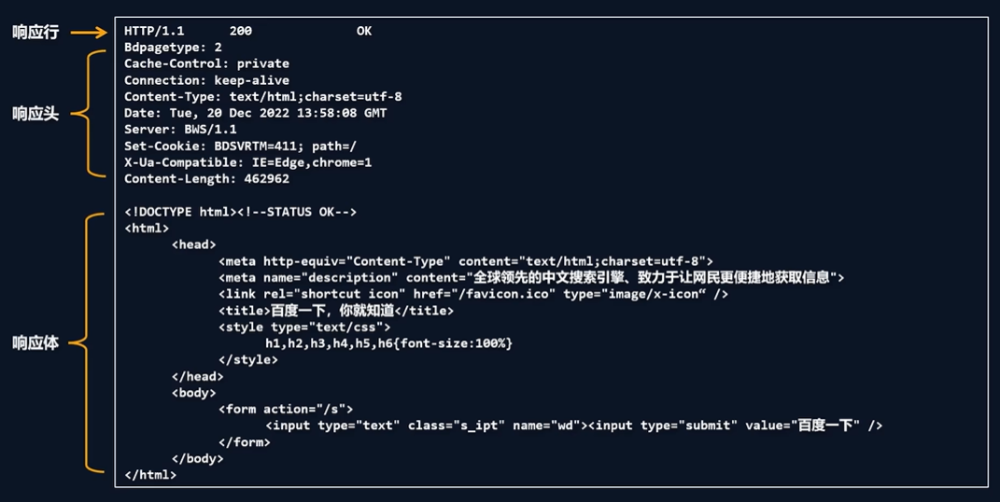

[b站传送门-nodejs尚硅谷](https://www.bilibili.com/video/BV1gM411W7ex?p=1)

## node介绍

Node.js 是一个开源的、跨平台的 JavaScript 运行时环境。

[nodejs下载](https://nodejs.org/en/download/prebuilt-installer)

使用`node 文件名`在命令行运行js代码

注意事项

- Node.js中不能使用BOM和DOM的API,可以使用console和定时器API
- Node,js中的顶级对象为~~global~~(实测新版本可能无法使用该对象),也可以用**globalThis**访问顶级对象

## 一. Buffer(缓冲器)模块

### 1. 概念

Buffer 是一个类似于数组的**对象** ，用于表示固定长度的字节序列。Buffer 本质是一段内存空间，专门用来处理**二进制数据** 。


### 2. 特点

1. Buffer 大小固定且无法调整
2. Buffer 性能较好，可以直接对计算机内存进行操作
3. 每个元素的大小为 1 字节（byte）


### 3. 使用

#### 3-1. 创建 Buffer

Node.js 中创建 Buffer 的方式主要如下几种：

1. Buffer.alloc
   ```javascript
   //创建了一个长度为 10 字节的 Buffer，相当于申请了 10 字节的内存空间，每个字节的值为 0
   let buf_1 = Buffer.alloc(10); // 结果为 <Buffer 00 00 00 00 00 00 00 00 00 00>
   ```

2. Buffer.allocUnsafe
   ```javascript
   //创建了一个长度为 10 字节的 Buffer，buffer 中可能存在旧的数据, 可能会影响执行结果，所以叫
   unsafe
   let buf_2 = Buffer.allocUnsafe(10);
   ```

3. Buffer.from
   ```js
   //通过字符串创建 Buffer
   let buf_3 = Buffer.from('hello');
   //通过数组创建 Buffer
   let buf_4 = Buffer.from([105, 108, 111, 118, 101, 121, 111, 117])
   ```

#### 3-2 Buffer 与字符串的转化

我们可以借助 toString 方法将 Buffer 转为字符串

```js
let buf_4 = Buffer.from([105, 108, 111, 118, 101, 121, 111, 117]);
console.log(buf_4.toString())// iloveyou
```

> toString 默认是按照 utf-8 编码方式进行转换的。

#### 3-3 Buffer 的读写

Buffer 可以直接通过 [] 的方式对数据进行处理。

```js
//读取
console.log(buf_3[1]);
//修改
buf_3[1] = 97;
//查看字符串结果
console.log(buf_3.toString())
```

> 注意:
>
> 1. 如果修改的数值超过 255 ，则超过 8 位数据会被舍弃
> 2. 一个 utf-8 的字符一般占 3 个字节

#### 3-4 Buffer 的溢出和中文

```js
// 溢出
let buf = Buffer.from('hello');
buf[0]=361;//舍弃高位的数字 只保留8位 高位归0 0001 0110 1001 => 0110 1001
console.log(buf)//<Buffer 69 65 6c 6c 6f>
```

```js
// 中文
let bufch = Buffer.from('你好')// 这里的中文是utf8编码 一个中文占三个字节
console.log(bufch)// <Buffer e4 bd a0 e5 a5 bd>
```

## 二. fs(文件系统)模块

fs 全称为**file system** ，称之为**文件系统** ，是 Node.js 中的**内置模块** ，可以对计算机中的磁盘进行操作。

fs模块可以实现与硬盘的交互，例如：文件的创建、删除、重命名、移动，还有文件内容的写入、读取，以及文件夹的相关操作

### 1. 文件写入

文件写入就是将**数据**保存到**文件**中，我们可以使用如下几个方法来实现该效果

| 方法                        | 说明     |
| --------------------------- | -------- |
| writeFile                   | 异步写入 |
| writeFileSync               | 同步写入 |
| appendFile / appendFileSync | 追加写入 |
| createWriteStream           | 流式写入 |

#### 1-1 writeFile 异步写入

语法：`fs.writeFile(file, data[, options], callback)`

参数说明：

- file 文件名
- data 待写入的数据
- options 选项设置 （可选）
  - **`encoding`**：指定写入文件时的字符编码，默认值是 `'utf8'`。可以设置为 `'ascii'`、`'base64'`、`'latin1'`、`'utf16le'`、`'ucs2'`、`'hex'` 等。
  - **`mode`**：设置文件的权限（Unix 文件模式），默认值为 `0o666`（可读可写）。它控制文件创建时的权限。
  - **`flag`**：指定文件打开的模式，比如 `'a'`、`'w'`、`'r'` 等。
    1. `'a'`：表示以**追加模式**（append）打开文件。如果文件已存在，内容会被追加到文件末尾；如果文件不存在，则会创建一个新文件。
    2. `'w'`：表示以写入模式（write）打开文件，默认就是该模式。如果文件已存在，文件内容会被清空并重新写入；如果文件不存在，则会创建一个新文件。
    3. `'r'`：表示以读取模式（read）打开文件。此模式用于读取文件内容，通常与写入无关。
    4. `'r+'`：表示以读写模式打开文件。文件必须存在，允许同时读取和写入。
    5. `'w+'`：表示以读写模式打开文件。如果文件存在，内容会被清空；如果文件不存在，则会创建一个新文件。
    6. `'a+'`：表示以追加读写模式打开文件。如果文件存在，内容会被追加；如果文件不存在，则会创建一个新文件。
- callback 写入回调

返回值： undefined

代码示例：
```js
// require 是 Node.js 环境中的'全局'变量，用来导入模块
const fs = require('fs');
//将 『三人行，必有我师焉。』 写入到当前文件夹下的『座右铭.txt』文件中 如果文件不存在，则自动创建文件
fs.writeFile('./座右铭.txt', '三人行，必有我师焉。', err => {
	//如果写入失败，则回调函数调用时，会传入错误对象，如写入成功，会传入 null
    if(err){
        console.log(err);
        return;
    } 
    console.log('写入成功')；
});
```

#### 1-2 writeFileSync 同步写入

语法：`fs.writeFileSync(file, data[, options])`

参数：与 `fs.writeFile` 大体一致，只是没有 `callback` 参数

返回值： undefined

代码示例：

```js
try{
	fs.writeFileSync('./座右铭.txt', '三人行，必有我师焉。');
}catch(e){
	console.log(e);
}
```

> Node.js 中的磁盘操作是由其他 线程 完成的，结果的处理有两种模式：
>
> - 同步处理 JavaScript 主线程**会等待**其他线程的执行结果，然后再继续执行主线程的代码，**效率较低**
> - 异步处理 JavaScript 主线程**不会等待**其他线程的执行结果，直接执行后续的主线程代码，**效率较好**

#### 1-3. appendFile/appendFileSync 追加写入

appendFile 作用是在**文件尾部追加内容**，appendFile 语法与 writeFile 语法完全相同

语法:

- `fs.appendFile(file, data[, options], callback)`
- `fs.appendFileSync(file, data[, options])`

此外还可以使用writeFile的追加写入模式进行追加

- `fs.writeFile(file, data, {flag: 'a'}, callback)`

返回值： 二者都为 undefined

实例代码：

fs.appendFile异步方式追加写入：

```js
fs.appendFile('./座右铭.txt','择其善者而从之，其不善者而改之。', err => {
if(err) throw err;
console.log('追加成功')
});
```

fs.appendFileSync同步方式追加写入：

```js
fs.appendFileSync('./座右铭.txt','\r\n温故而知新, 可以为师矣');
```

异步 writeFile方式追加写入 flag: a 表示以追加模式写入:

```js
fs.writeFile('./座右铭.txt', 'love love love', {flag: 'a'}, err => {
    if (err) {
        console.log('写入失败');
        return
    }
    console.log('写入成功');
})
```

#### 1-4. createWriteStream 流式写入

语法：`fs.createWriteStream(path[, options])`

参数说明：

- path 文件路径
- options 选项配置（ 可选 ）

返回值：`Object`

代码示例：

```js
// 1. 导入fs
const fs = require('fs')
// 2. 创建写入流对象
const ws = fs.createWriteStream('./观书有感.txt');
// 3. write
ws.write('半亩方塘一鉴开，')
ws.write('天光云影共徘徊。\r\n')
ws.write('问渠哪得清如许？')
ws.write('为有源头活水来。\r\n')
// 4. 关闭通道
// ws.close();
ws.end()
```

> 关闭流两种方法的区别
>
> - `ws.end()`:此方法用于结束可写流，用户可以在此处选择性地写入数据。调用 `end()` 会触发流的结束，同时确保所有待写入的数据都被写入。你可以在 `end()` 方法中传递一个字符串作为最后写入的数据，也可以不传递，直接结束流。它会自动关闭流。
>   - 示例：
>     `ws.end('这是最后一行。\r\n'); ` 
> - `ws.close()`:此方法直接关闭流，不会处理待写入的数据。它是一个更低级的操作，通常不建议在写入流时直接使用，因为如果在 close() 被调用时还有数据未写入，可能会导致数据丢失。
>
> 一般情况下，推荐使用 `ws.end() `来优雅地结束写入流，确保所有数据都已写入并处理完毕。如果你只是想立即关闭流，而不关心是否有数据未写入，可以使用 `ws.close()`。

> **程序打开一个文件是需要消耗资源的**，流式写入可以减少打开关闭文件的次数。流式写入方式适用于**大文件写入或者频繁写入**的场景, writeFile 适合于**写入频率较低的场景**

#### 1-5 写入文件的场景 

文件写入 在计算机中是一个非常常见的操作，下面的场景都用到了文件写入

- 下载文件
- 安装软件
- 保存程序日志，如 Git
- 编辑器保存文件
- 视频录制

> 当**需要持久化保存数据**的时候，应该想到**文件写入**  

### 2. 文件读取

文件读取顾名思义，就是通过程序从文件中取出其中的数据，我们可以使用如下几种方式：

| 方法                | 说明     |
| ------------------- | -------- |
| `readFile `         | 异步读取 |
| `readFileSync `     | 同步读取 |
| `createReadStream ` | 流式读取 |

#### 2-1 readFile 异步读取

语法： `fs.readFile(path[, options], callback)`

参数说明：

- `path` 文件路径
- `options` 选项配置
- `callback` 回调函数

返回值： `undefined`

代码示例：

```js
// 1. 引入 fs 模块
const { log } = require('console');
const fs = require('fs');
// 2. 异步读取
fs.readFile('./观书有感.txt', (err, data) => {
    if (err) {
        console.log('读取失败~~');
        return;
    }
    console.log(data);// 直接打印是buffer
    console.log("data:\n" + data);// 打印内容 进行字符串拼接，Buffer自动转换为字符串，输出的是文件的实际内容。
    console.log("data.toString():\n" + data.toString());// 打印文件内容
})
```

#### 2-2 readFileSync 同步读取

语法：`fs.readFileSync(path[, options])`

参数说明：

- path 文件路径
- options 选项配置

返回值： `string | Buffer`

代码示例：

```js
let data = fs.readFileSync('./观书有感.txt')
console.log(data);// 打印buffer
console.log("readFileSync:" + data);// 打印内容 进行字符串拼接，Buffer自动转换为字符串，输出的是文件的实际内容。
console.log(data.toString());// 打印内容
```

#### 2-3 createReadStream 流式读取

语法： `fs.createReadStream(path[, options])`

参数说明：

- `path` 文件路径
- `options` 选项配置（ 可选 ）

返回值： `Object`

代码示例：

```JS
//创建读取流对象
let rs = fs.createReadStream('./观书有感.txt');
//每次取出 64k 数据后执行一次 data 回调
rs.on('data', chunk => {
    // console.log(chunk);// buffer 数据
    console.log(chunk.length);// 每次65536 字节 => 64kb
})
// end 回调 (可选) 该回调函数在读取完成后调用
rs.on('end', () => {
	console.log('读取完成')
})
```


#### 2-4 读取文件应用场景

- 电脑开机
- 程序运行
- 编辑器打开文件
- 查看图片
- 播放视频
- 播放音乐
- Git 查看日志
- 上传文件
- 查看聊天记录

#### 2-t 练习-文件复制

需求:复制【资料】文件夹下的【demo1.mp4】文件
```js
// 导入文件模块fs
const fs = require('fs');
const process = require('process');// 这个模块在这里是测试占用内存大小的

/* 
// 方式一：readFile
// 1. 读取文件内容
let data = fs.readFileSync('../资料/demo1.mp4')
// 2. 写入文件
fs.writeFileSync('../资料/demo1-copy1.mp4', data);
// 占用内存大小
console.log(process.memoryUsage());// 36802560 字节 -> 35MB
 */

// 方式二：流式操作
// 1. 创建读取流对象
const rs = fs.createReadStream('../资料/demo1.mp4');
// 2. 创建一个写入流对象
const ws = fs.createWriteStream('../资料/demo1-copy2.mp4')
/* 
// 3. 复制 绑定 data 事件 读一块写一块
rs.on('data', chunk => {
    ws.write(chunk);
})

rs.on('end', () => {
    // 占用内存大小
    console.log(process.memoryUsage());// 34070528 字节 -> 32MB// 文件越大流式传输占用的空间较普通的传输方式节省越多
})
 */

// 3. 复制 pipe这种方式用的不多
rs.pipe(ws);
```

### 3. 文件移动与重命名

在 Node.js 中，我们可以使用`rename`或`renameSync`来移动或重命名文件或文件夹

语法：

- `fs.rename(oldPath, newPath, callback)` 
- `fs.renameSync(oldPath, newPath)`

参数说明：

- `oldPath` 文件当前的路径
- `newPath` 文件新的路径
- `callback` 操作后的回调

代码示例：

```js
// 1. 导入 fs 模块
const fs = require('fs');

// 2. 文件重命名
fs.rename('./座右铭.txt', './论语.txt', err => {
    if (err) {
        console.log("操作失败~");
        return;
    }
    console.log("操作成功~");
})


// 3. 文件的移动
fs.rename('./data.txt', '../资料/data.txt', err => {
    if (err) {
        console.log("操作失败~");
        return;
    }
    console.log("操作成功~");
})
```

### 4. 文件删除

在 Node.js 中，我们可以使用 `unlink` 或 `unlinkSync` 来删除文件

语法：

- `fs.unlink(path, callback)` 

- `fs.unlinkSync(path)`

参数说明：

- `path` 文件路径
- `callback` 操作后的回调代码示例：

> 注：在v14.4版本及其以上也可以使用`rm`或`rmSync`来删除文件，参数同上

```js
// 1. 导入 fs 模块
const fs = require('fs');

// 2.1 调用 unlink 方法删除文件  unlinkSync
fs.unlink('./观书有感.txt', err => {
    if (err) {
        console.log('删除失败~');
        return;
    }
    console.log('删除成功~');
});

// 2.2 调用 rm 方法删除文件(v14.4+)  rmSync
fs.rm('./论语.txt', err => {
    if (err) {
        console.log('删除失败~');
        return;
    }
    console.log('删除成功~');
});

// 2.3 读取文件夹
fs.readdir('../资料', (err, data) => {
    if (err) {
        console.log('读取失败~');
        return;
    }
    console.log('读取成功：' + data);  // 读取成功：data.txt,demo1.mp4
}) 
```

### 5. 文件夹操作

借助 Node.js 的能力，我们可以对文件夹进行 创建 、 读取 、 删除 等操作  

| 方法                                 | 说明       |
| ------------------------------------ | ---------- |
| `mkdir` / `mkdirSync `               | 创建文件夹 |
| `readdir` / `readdirSync `           | 读取文件夹 |
| `rmdir` / `rmdirSync `/`rm`/`rmSync` | 删除文件夹 |

#### 5.1 `mkdir` 创建文件夹

在 Node.js 中，我们可以使用 `mkdir` 或 `mkdirSync` 来创建文件夹

语法：

- `fs.mkdir(path[, options], callback) `
- `fs.mkdirSync(path[, options])`

参数说明：

- `path` 文件夹路径
- `options` 选项配置（ 可选 ）
- `callback` 操作后的回调

示例代码：

```js
// 创建文件夹  mk  make 制作  dir directory 文件夹
fs.mkdir('./html', err => {
    if (err) {
        console.log('创建失败~');
        return;
    }
    console.log('创建成功~');
})

// 递归创建 {recursive: true}开启递归创建
fs.mkdir('./a/b/c', {recursive: true}, err => {
    if (err) {
        console.log('创建失败~');
        return;
    }
    console.log('创建成功~');
})
```

#### 5.2 `readdir` 读取文件夹

在 Node.js 中，我们可以使用 `readdir` 或 `readdirSync` 来读取文件夹

语法：

- `fs.readdir(path[, options], callback)`
- ` fs.readdirSync(path[, options])`

参数说明：

- `path` 文件夹路径\
- `options` 选项配置（ 可选 ）
- `callback` 操作后的回调

示例代码：

```js
fs.readdir('../资料', (err, data) => {
    if (err) {
        console.log('读取失败~');
        return;
    }
    console.log('读取成功：' + data);  // 读取成功：data.txt,demo1.mp4
}) 
```

#### 5.3 `rmdir`/`rm` 删除文件夹

在 Node.js 中，我们可以使用` rmdir` 或 `rmdirSync` 来删除文件夹

语法：

- `fs.rmdir(path[, options], callback) `
- `fs.rmdirSync(path[, options])`

参数说明：

- `path` 文件夹路径
- `options` 选项配置（ 可选 ）
- ` callback` 操作后的回调

示例代码：

```js
// 2.4 删除文件夹
fs.rmdir('./html', err => {
    if (err) {
        console.log('删除失败~');
        return;
    }
    console.log('删除成功');  // 读取成功：data.txt,demo1.mp4
})

// 2.5 递归删除文件夹  rmdir不推荐使用 会有警告 提示rmdir方法可能在将来会被删除 建议用rm删除文件夹
fs.rmdir('./a', {recursive: true}, err => {
    if (err) {
        console.log('删除失败~' + err);
        return;
    }
    console.log('删除成功');  // 读取成功：data.txt,demo1.mp4
})

// 2.6 递归删除文件夹  rm删除文件夹 建议使用这个
fs.rm('./a', {recursive: true}, err => {
    if (err) {
        console.log('删除失败~' + err);
        return;
    }
    console.log('删除成功');  // 读取成功：data.txt,demo1.mp4
})
```

### 6. 查看资源状态 

在 Node.js 中，我们可以使用` stat` 或 `statSync` 来查看资源的详细信息

语法：

- `fs.stat(path[, options], callback) `
- `fs.statSync(path[, options])`

参数说明：

- `path` 文件夹路径
- `options` 选项配置（ 可选 ） 
- `callback `操作后的回调

示例代码：

```js
// 1. 导入 fs 模块
const fs = require('fs');

// stat 方法  status 缩写 状态
fs.stat('../资料/demo1.mp4', (err, data) => {
    if (err) {
        console.log('操作失败');
        return;
    }
    console.log(data);
    /*
    Stats {
        dev: 2055620328,
        mode: 33206,
        nlink: 1,
        uid: 0,
        gid: 0,
        rdev: 0,
        blksize: 4096,
        ino: 562949953738064,
        size: 11546856,
        blocks: 22560,
        atimeMs: 1727592074068.7017,
        mtimeMs: 1727590366724.0388,
        ctimeMs: 1727590434360.618,
        birthtimeMs: 1727590429396.402,
        atime: 2024-09-29T06:41:14.069Z,
        mtime: 2024-09-29T06:12:46.724Z,
        ctime: 2024-09-29T06:13:54.361Z,
        birthtime: 2024-09-29T06:13:49.396Z
    }
    */

    // isFile 是否是文件
    console.log(data.isFile());  // true

    // isDirectory  是否是文件夹
    console.log(data.isDirectory());  // false
})
```

data结果值对象结构：

- `size` 文件体积
- `birthtime` 创建时间
- `mtime` 最后修改时间
- `isFile` 检测是否为文件
- `isDirectory` 检测是否为文件夹
- ……

### 7. 相对路径问题

fs 模块对资源进行操作时，路径的写法有两种：

1. 相对路径
   - `./座右铭.txt` 当前目录下的`座右铭.txt`
   - `座右铭.txt` 等效于上面的写法
   - `../座右铭.txt` 当前目录的上一级目录中的`座右铭.txt`
2. 绝对路径
   - `D:/Program Files` windows 系统下的绝对路径
   - `/usr/bin` Linux 系统下的绝对路径

```js
// 1. 导入 fs 模块
const fs = require('fs');

// 相对路径 bug：相对路径参照物: 参照的是命令行的工作目录,不是该文件的所在目录
fs.writeFileSync('./index.html', 'love');  // (命令行工作文件夹)当前文件夹
fs.writeFileSync('index.html', 'love'); // (命令行工作文件夹)当前文件夹

// 绝对路径
fs.writeFileSync('D:/index.html', 'love');
fs.writeFileSync('/index.html', 'love'); // 盘符最外层
```

> 相对路径中所谓的 当前目录 ，指的是 命令行的工作目录 ，而并非是文件的所在目录所以当命令行的工作目录与文件所在目录不一致时，会出现一些 **BUG**，可以使用**`__dirname`**解决bug

bug 及 解决方式：

```js
// bug  相对路径参照物: 参照的是命令行的工作目录,不是该文件的所在目录
fs.writeFileSync('/index.html', 'love');

// 绝对路径 '全局变量' 保存的是所在文件的所在目录的绝对路径
console.log(__dirname);  // D:\workspace\stuspace\webObject\nodejs\nodejs-shangguigu\4.fs
// 解决 bug: 使用绝对路径
fs.writeFileSync(__dirname + '/index.html', 'love');
```

### 8. 批量重命名

```js
// 1. 导入 fs 模块
const fs = require('fs');
// 读取 code 文件夹
const files = fs.readdirSync(`${__dirname}/`);
// 遍历数组 重命名
files.forEach(item => {
    // 拆分文件名  改名前文件名字：1.aaa.js
    let data = item.split('-');
    let [num, name1, name2] = data;
    console.log(num, name1, name2); // 1 aaa js
    // 判断
    if (Number(num) < 10) {
        num = '0' + num;
    }
    // 创建新文件名
    let newName = num + '.' + name1 + '.' + name2;
    // 重命名
    fs.renameSync(`${__dirname}/${item}`, `${__dirname}/${newName}`);
})

```

## 三. path(操作路径)模块

path 模块提供了操作路径的功能，我们将介绍如下几个较为常用的几个 API：  

| API              | 说明                     |
| ---------------- | ------------------------ |
| `path.resolve `  | 拼接规范的绝对路径 常用  |
| `path.sep `      | 获取操作系统的路径分隔符 |
| `path.parse `    | 解析路径并返回对象       |
| `path.basename ` | 获取路径的基础名称       |
| `path.dirname `  | 获取路径的目录名         |
| `path.extname `  | 获得路径的扩展名         |

代码示例：  

```js
//导入 fs
const fs = require('fs');
const path = require('path');
//写入文件
// fs.writeFileSync(__dirname + '/index.html', 'love');
console.log(__dirname + '/index.html');  // D:\workspace\stuspace\webObject\nodejs\nodejs-shangguigu\5.path/index.html

//resolve  解决
console.log(path.resolve(__dirname, './index.html'));  // D:\workspace\stuspace\webObject\nodejs\nodejs-shangguigu\5.path\index.html
// console.log(path.resolve(__dirname, 'index.html'));
// console.log(path.resolve(__dirname, '/index.html', './test'));

// sep 分隔符 返回不同系统的分隔符
console.log(path.sep); // windows时：\  Linux时：/

// parse 方法  解析路径并返回对象   __dirname  '全局变量'
console.log(__filename); // 文件的绝对路径
let str = 'D:\\nodeJS\\13-path\\代码\\path.js';
console.log(path.parse(str));  /* path.parse(str)：
                                    {
                                    root: 'D:\\',
                                    dir: 'D:\\nodeJS\\13-path\\代码',
                                    base: 'path.js',
                                    ext: '.js',
                                    name: 'path'
                                    }
                                */

// basename
console.log(path.basename(str)); // path.js

// dirname
console.log(path.dirname(str)); // D:\nodeJS\13-path\代码

// extname
console.log(path.extname(str)); // .js
```

## 四.HTTP 协议  

### 1. 概念

HTTP（hypertext transport protocol）协议；中文叫**超文本传输协议**，是一种基于TCP/IP的应用层通信协议，这个协议详细规定了 `浏览器` 和`万维网` 服务器 之间互相通信的规则。

协议中主要规定了两个方面的内容:

- 客户端：用来向服务器发送数据，可以被称之为**请求报文**
- 服务端：向客户端返回数据，可以被称之为响应**报文报文**

> 报文：可以简单理解为就是一堆字符串 

### 2. 请求报文的组成



- 请求行
- 请求头
- 空行
- 请求体

### 3. HTTP 的请求行

- 请求方法（get、post、put、delete等）
- 请求 URL（统一资源定位器）
  例如：http://www.baidu.com:80/index.html?a=100&b=200#logo 
  - http： 协议（https、ftp、ssh等）
  - www.baidu.com 域名
  - 80 /index.html a=100&b=200 #logo
  - 端口号路径查询字符串哈希（锚点链接）
-  HTTP协议版本号

### 4. HTTP 请求头

格式：`头名：头值`

**常见的请求头有：**

| 请求头                    | 解释                                                         |
| ------------------------- | ------------------------------------------------------------ |
| `Host`                    | 主机名                                                       |
| `Connection`              | 连接的设置 keep-alive（保持连接）；close（关闭连接）         |
| `Cache-Control`           | 缓存控制 max-age = 0 （没有缓存）                            |
| `UpgradeInsecureRequests` | 将网页中的http请求转化为https请求（很少用）老网站升级        |
| `User-Agent`              | 用户代理，客户端字符串标识，服务器可以通过这个标识来识别这个请求来自哪个客户端 ，一般在PC端和手机端的区分 |
| `Accept`                  | 设置浏览器接收的数据类型                                     |
| `Accept-Encoding`         | 设置接收的压缩方式                                           |
| `AcceptLanguage`          | 设置接收的语言 q=0.7 为喜好系数，满分为1                     |
| `Cookie`                  | 后面单独讲                                                   |

### 5. HTTP 的请求体

请求体内容的格式是非常灵活的， 

- （可以是空）=\=> GET请求
- （也可以是字符串，还可以是JSON）=\=> POST请求

例如：

- 字符串：`keywords=手机&price=2000`
- JSON：`{"keywords":"手机","price":2000}`

### 6. 响应报文的组成



**响应行：**

```shell
HTTP/1.1 200 OK
```

- `HTTP/1.1`：HTTP协议版本号
- `200`：响应状态码 `404` Not Found, `500` Internal Server Error
  还有一些状态码，参考：https://developer.mozilla.org/zh-CN/docs/Web/HTTP/Status 
- `OK`：响应状态描述

> 响应状态码和响应字符串关系是一一对应的。

**响应头：**

```shell
Cache-Control:缓存控制 private 私有的，只允许客户端缓存数据
Connection 链接设置
Content-Type:text/html;charset=utf-8 设置响应体的数据类型以及字符集,响应体为html，字符集
utf-8
Content-Length:响应体的长度，单位为字节
```

- 空行
- 响应体

响应体内容的类型是非常灵活的，常见的类型有 HTML、CSS、JS、图片、JSON

### 7. 创建 HTTP 服务

使用 nodejs 创建 HTTP 服务

#### 7.1 操作步骤

```js
//1. 导入 http 模块
const http = require('http');
//2. 创建服务对象 create 创建 server 服务
// request 意为请求. 是对请求报文的封装对象, 通过 request 对象可以获得请求报文的数据
// response 意为响应. 是对响应报文的封装对象, 通过 response 对象可以设置响应报文
const server = http.createServer((request, response) => {
response.end('Hello HTTP server');
});
//3. 监听端口, 启动服务
server.listen(9000, () => {
console.log('服务已经启动, 端口 9000 监听中...');
});
```

> http.createServer 里的回调函数的执行时机： 当接收到 HTTP 请求的时候，就会执行  
