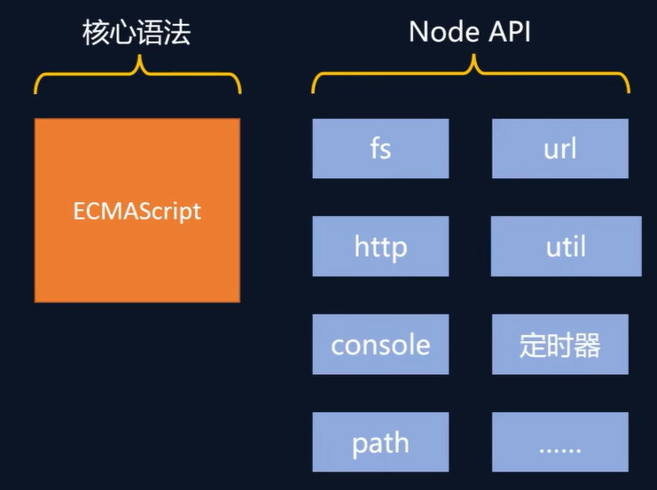

## node介绍

Node.js 是一个开源的、跨平台的 JavaScript 运行时环境。

[nodejs下载](https://nodejs.org/en/download/prebuilt-installer)

使用`node 文件名`在命令行运行js代码



注意事项

- Node.js中不能使用BOM和DOM的API,可以使用console和定时器API
- Node,js中的顶级对象为~~global~~(实测新版本可能无法使用该对象),也可以用**globalThis**访问顶级对象

## 一. Buffer(缓冲器)

### 1. 概念

Buffer 是一个类似于数组的**对象** ，用于表示固定长度的字节序列。Buffer 本质是一段内存空间，专门用来处理**二进制数据** 。


### 2. 特点

1. Buffer 大小固定且无法调整
2. Buffer 性能较好，可以直接对计算机内存进行操作
3. 每个元素的大小为 1 字节（byte）


### 3. 使用

#### 3-1. 创建 Buffer

Node.js 中创建 Buffer 的方式主要如下几种：

1. Buffer.alloc
   ```javascript
   //创建了一个长度为 10 字节的 Buffer，相当于申请了 10 字节的内存空间，每个字节的值为 0
   let buf_1 = Buffer.alloc(10); // 结果为 <Buffer 00 00 00 00 00 00 00 00 00 00>
   ```

2. Buffer.allocUnsafe
   ```javascript
   //创建了一个长度为 10 字节的 Buffer，buffer 中可能存在旧的数据, 可能会影响执行结果，所以叫
   unsafe
   let buf_2 = Buffer.allocUnsafe(10);
   ```

3. Buffer.from
   ```js
   //通过字符串创建 Buffer
   let buf_3 = Buffer.from('hello');
   //通过数组创建 Buffer
   let buf_4 = Buffer.from([105, 108, 111, 118, 101, 121, 111, 117])
   ```

#### 3-2 Buffer 与字符串的转化

我们可以借助 toString 方法将 Buffer 转为字符串

```js
let buf_4 = Buffer.from([105, 108, 111, 118, 101, 121, 111, 117]);
console.log(buf_4.toString())// iloveyou
```

> toString 默认是按照 utf-8 编码方式进行转换的。

#### 3-3 Buffer 的读写

Buffer 可以直接通过 [] 的方式对数据进行处理。

```js
//读取
console.log(buf_3[1]);
//修改
buf_3[1] = 97;
//查看字符串结果
console.log(buf_3.toString())
```

> 注意:
>
> 1. 如果修改的数值超过 255 ，则超过 8 位数据会被舍弃
> 2. 一个 utf-8 的字符一般占 3 个字节

#### 3-4 Buffer 的溢出和中文

```js
// 溢出
let buf = Buffer.from('hello');
buf[0]=361;//舍弃高位的数字 只保留8位 高位归0 0001 0110 1001 => 0110 1001
console.log(buf)//<Buffer 69 65 6c 6c 6f>
```

```js
// 中文
let bufch = Buffer.from('你好')// 这里的中文是utf8编码 一个中文占三个字节
console.log(bufch)// <Buffer e4 bd a0 e5 a5 bd>
```

## fs 模块

fs 全称为**file system** ，称之为**文件系统** ，是 Node.js 中的**内置模块** ，可以对计算机中的磁盘进行操作。

fs模块可以实现与硬盘的交互，例如：文件的创建、删除、重命名、移动，还有文件内容的写入、读取，以及文件夹的相关操作

### 1. 文件写入

文件写入就是将**数据**保存到**文件**中，我们可以使用如下几个方法来实现该效果

| 方法                        | 说明     |
| --------------------------- | -------- |
| writeFile                   | 异步写入 |
| writeFileSync               | 同步写入 |
| appendFile / appendFileSync | 追加写入 |
| createWriteStream           | 流式写入 |

#### 1-1 writeFile 异步写入

语法：`fs.writeFile(file, data[, options], callback)`

参数说明：

- file 文件名
- data 待写入的数据
- options 选项设置 （可选）
- callback 写入回调

返回值： undefined

代码示例：
```js
// require 是 Node.js 环境中的'全局'变量，用来导入模块
const fs = require('fs');
//将 『三人行，必有我师焉。』 写入到当前文件夹下的『座右铭.txt』文件中 如果文件不存在，则自动创建文件
fs.writeFile('./座右铭.txt', '三人行，必有我师焉。', err => {
	//如果写入失败，则回调函数调用时，会传入错误对象，如写入成功，会传入 null
    if(err){
        console.log(err);
        return;
    } 
    console.log('写入成功')；
});
```

#### 1-2 writeFileSync 同步写入

语法：`fs.writeFileSync(file, data[, options])`

参数：与 `fs.writeFile` 大体一致，只是没有 `callback` 参数

返回值： undefined

代码示例：

```js
try{
	fs.writeFileSync('./座右铭.txt', '三人行，必有我师焉。');
}catch(e){
	console.log(e);
}
```

> Node.js 中的磁盘操作是由其他 线程 完成的，结果的处理有两种模式：
>
> - 同步处理 JavaScript 主线程**会等待**其他线程的执行结果，然后再继续执行主线程的代码，**效率较低**
> - 异步处理 JavaScript 主线程**不会等待**其他线程的执行结果，直接执行后续的主线程代码，**效率较好**

#### 1-3. appendFile/appendFileSync 追加写入

appendFile 作用是在**文件尾部追加内容**，appendFile 语法与 writeFile 语法完全相同

语法:

- `fs.appendFile(file, data[, options], callback)`
- `fs.appendFileSync(file, data[, options])`

返回值： 二者都为 undefined

实例代码：

```js
```

